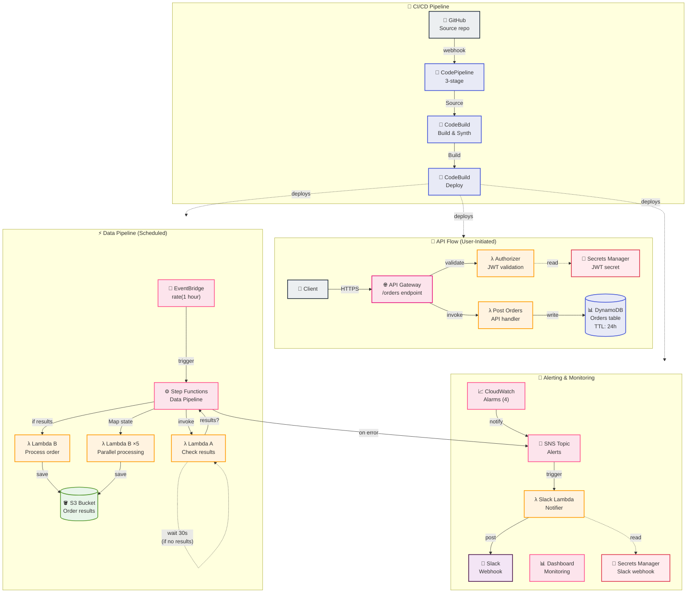
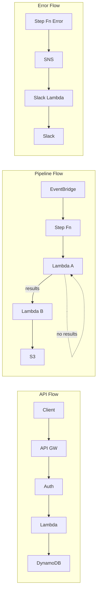

# WattsUp AWS Architecture

> Serverless Energy Auction System - Infrastructure Stack + Pipeline Stack

## Architecture Diagram

## Component Summary

### 📡 API Flow (User-Initiated)
| Component | Purpose |
|-----------|---------|
| API Gateway | REST API with `/orders` endpoint, throttling (50 req/s), CORS |
| Authorizer Lambda | JWT validation using HS256, 5-min cache |
| Post Orders Lambda | Validates input, writes to DynamoDB with 24h TTL |
| DynamoDB | Orders table, PAY_PER_REQUEST, Point-in-Time Recovery |

### ⚡ Data Pipeline (Scheduled)
| Component | Purpose |
|-----------|---------|
| EventBridge | Triggers pipeline every hour |
| Step Functions | Orchestrates workflow, 1h timeout, full logging |
| Lambda A | Checks if results are ready, returns `{results: true/false}` |
| Lambda B | Processes orders, saves to S3, max 5 parallel |
| S3 Bucket | Stores results, lifecycle: IA@30d, Glacier@90d |

### 🔔 Alerting & Monitoring
| Component | Purpose |
|-----------|---------|
| CloudWatch Alarms | Lambda errors, Pipeline failures, API 5XX, DynamoDB throttling |
| SNS Topic | Central alert hub |
| Slack Lambda | Forwards alerts to Slack |
| Dashboard | 4 widgets: invocations, errors, API requests, pipeline executions |

### 🚀 CI/CD Pipeline
| Component | Purpose |
|-----------|---------|
| GitHub | Source repository via CodeStar Connection |
| CodePipeline | 3 stages: Source → Build → Deploy |
| CodeBuild (Build) | TypeScript compilation, CDK synthesis |
| CodeBuild (Deploy) | Executes `cdk deploy`, scoped IAM permissions |

## Data Flows

## Quick Reference

- **Runtime**: Python 3.12 (all Lambdas)
- **Region**: eu-west-1
- **Environments**: dev, staging, prod
- **Removal Policy**: RETAIN (prod), DESTROY (others)
